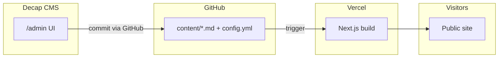
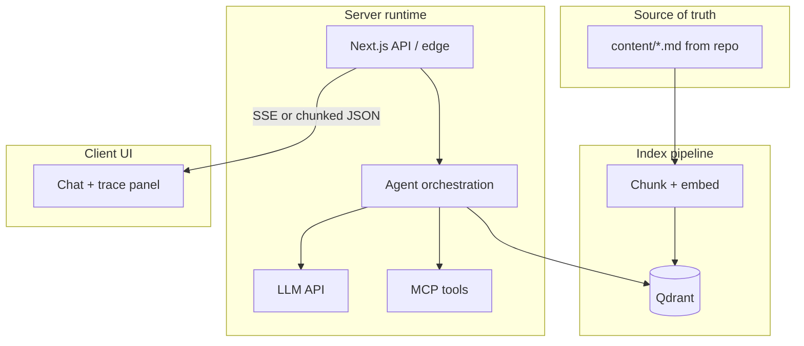

# Portfolio implementation plan — Git-based CMS (Decap)

This document turns the agreed strategy into an executable build order. **Decisions locked for this plan:** Next.js (App Router) + TypeScript, deploy on **Vercel** from **GitHub**, long-form content as **Markdown with frontmatter**, **solo** access to the CMS via GitHub login, **Qdrant** ([Qdrant Cloud](https://cloud.qdrant.io/) Free Tier or paid) as the **vector database** for the RAG layer, and a **modern, highly interactive UI** (see **§ UI and interaction engineering**) to showcase front-end and product engineering—not a static brochure.

---

## Goals

1. Ship a fast, credible portfolio aligned with the differentiation strategy (impact metrics, case studies, optional demo).
2. Edit **profile, experiences, projects, skills, certifications, and long-form pages** from `/admin` without touching React for routine updates.
3. Keep content **in the repo** (Git-backed), with Vercel rebuilds on commit.
4. **Optional (planned):** RAG over portfolio content, **MCP**-backed tools, and a **visible agent workflow** (steps, retrieval, tool I/O) in the chat UI.
5. **UI quality:** Use **contemporary interactive patterns** (motion, accessible primitives, polished micro-interactions) so the site itself signals engineering taste—especially on the **agent demo** and **project/case-study** surfaces.

---

## UI and interaction engineering (locked direction)

The portfolio should feel **intentionally built**, not template-default. Interactions are part of the proof: you ship **usable, accessible, animated** interfaces—not only backends and models.

### Principles

- **Progressive enhancement:** Core content readable without JS; enhanced with motion and client islands.
- **Accessibility:** Keyboard focus, ARIA from primitives, **`prefers-reduced-motion`** respected (shorten or disable non-essential animation).
- **Performance:** Prefer **CSS** for simple hovers; use **Motion** (Framer Motion / `motion`) for orchestrated enters and layout; avoid layout thrash and huge client bundles.
- **Cohesion:** One **design token** layer (radius, spacing, typography scale, semantic colors) in Tailwind—avoid random one-off styles.

### Recommended stack (implement in Phase 0–3)

| Layer | Choice | Role |
| ----- | ------ | ---- |
| Styling | **Tailwind CSS** | Tokens, responsive layout, dark mode hooks |
| Primitives | **Radix UI** via **shadcn/ui** (copy-in components) | Dialogs, tabs, accordion, tooltip, scroll-area—accessible by default |
| Motion | **`motion`** (formerly Framer Motion) or **Framer Motion** | Section reveals, staggered lists, route/section transitions |
| Theme | **`next-themes`** (optional) | Dark / light toggle without flash |
| Icons | **lucide-react** (pairs with shadcn) | Consistent iconography |

### Patterns to showcase engineering (apply across Phase 3–4 and 4b)

- **Hero:** Subtle motion (gradient mesh, staggered headline, or line reveal)—not a generic purple blob.
- **Impact metrics:** Animated counters or **in-view** count-up; cards with hover elevation and clear hierarchy.
- **Experience:** **Vertical timeline** with animated connector and expandable detail—or horizontal scroll-snap on mobile.
- **Projects / case studies:** **Bento-style** or **card grid** with hover preview (image tilt, border gradient, or “peek” summary); dedicated project page with **sticky subnav** or **reading progress** for long MDX.
- **Skills:** Interactive **tabs** or **filter chips** (by category), not a static wall of logos.
- **Agent demo (Phase 4b):** **Split view**: chat + **live trace panel** (retrieval chunks, tool call cards with JSON syntax highlight, streaming tokens); **stepper** or **timeline** for agent phases; skeleton loaders during latency.

### Deliverables by phase

- **Phase 0:** Tailwind + shadcn init + `components/ui` baseline + motion dependency; global layout shell with nav + footer.
- **Phase 3:** Section components built from primitives; no “raw” HTML for repeated patterns.
- **Phase 4:** Motion passes, hover states, responsive polish; optional theme toggle.
- **Phase 4b:** Agent UI as the **most interactive** surface—this is the technical flex alongside RAG.

### Risks and mitigations (UI)

| Risk | Mitigation |
| ---- | ---------- |
| Motion sickness / a11y | `prefers-reduced-motion`, reduce parallax |
| CLS | Reserve space for images; font `display: swap` + dimensions |
| Bundle size | Tree-shake Radix; lazy-load heavy demo route |

---

## Architecture (high level)

- **Decap** reads/writes files under something like `content/` and `public/admin/` (or equivalent per Decap’s Next.js integration path you choose).
- **Next.js** reads Markdown at **build time** (e.g. `gray-matter` + `remark`/`MDX`, or `contentlayer` / `velite` if you want generated types—optional in phase 2).
- **No database** required for CMS alone; **RAG + agent demo** adds **Qdrant** for vectors and **server-side** LLM calls—see **§ Interactive agent layer (RAG + MCP + observability)** below.

---

## Interactive agent layer (RAG + MCP + observability) — feasibility and add-ons

### Is this feasible with the current architecture?

**Yes.** The Git-based CMS remains the **source of truth** for text. You add a **runtime layer** that:

1. **Indexes** that content for search (RAG): chunk → embed → store vectors; on each production deploy (or scheduled job), **rebuild or upsert** the index so new Decap commits show up after build.
2. **Runs an agent loop** on the server: retrieve relevant chunks → call an LLM → optionally call **tools** exposed via **MCP** (or MCP-compatible tools).
3. **Streams structured events** to the browser (retrieval hits, tool names, arguments, partial answers) so users **see how data moves**—not only the final reply.

Decap and static pages are unchanged; the demo is typically a **route** (e.g. `/ask` or `/demo`) that talks to **Next.js Route Handlers** (`app/api/...`) or a small **separate service** if you outgrow serverless limits.

### Conceptual diagram (optional layer)

### What you need to build (additional to CMS + static site)

| Area | What to add | Why |
| ---- | ----------- | --- |
| **Chunking + embeddings** | Script or build step: split Markdown into chunks (by heading/section), call an **embedding API** (e.g. OpenAI, Voyage, etc.) | RAG requires vector representations of your content. |
| **Vector store** | **[Qdrant Cloud](https://qdrant.tech/pricing)** (locked) — create a cluster, store **URL + API key** in Vercel env; use official **JavaScript/TypeScript client** from the app or index script | Persist embeddings; hybrid + similarity search; **Free Tier** is enough for a portfolio prototype (limits per [pricing](https://qdrant.tech/pricing); upgrade if storage/RAM exceeded). |
| **Index sync** | On `postbuild` / Vercel deploy hook / cron: re-embed changed content | After Decap commits, new text must enter the index (same deploy pipeline or short lag). |
| **Chat + agent API** | Route Handler: accept user message → retrieve top-k chunks → **optional** MCP tool calls → LLM with citations | Core server logic; keep **API keys only on server**. |
| **MCP** | One or more **tools** (e.g. `get_project`, `list_skills`, `search_site`) implemented with [`@modelcontextprotocol/sdk`](https://github.com/modelcontextprotocol/typescript-sdk) or equivalent | Agents call **structured** tools instead of only free-form generation; demonstrates MCP-style contracts. |
| **Transport note** | MCP in production often uses **HTTP** or **in-process** tool registration on serverless; **stdio** MCP servers are awkward on Vercel cold starts—prefer **one process** that registers tools, or a **tiny sidecar** (Fly/Railway) if you need a long-lived stdio server. | Practical deployment on Vercel. |
| **Observability UI** | React state + streaming protocol: emit events `{ type: 'retrieve', chunks: [...] }`, `{ type: 'tool_call', name, args }`, `{ type: 'token', ... }` | Users **see** retrieval and tool exchange as requested. |
| **Guardrails** | Rate limiting, max tokens, prompt scope (“only portfolio topics”), optional CAPTCHA | Public chat endpoints get abused without limits. |
| **Cost controls** | Env vars for model choice; daily caps; cache frequent queries | LLM + embedding APIs are ongoing cost. |

### How this interacts with Decap

- **Editing** still happens in `/admin`; content is still **files in Git**.
- **Publishing** triggers a **build**; the **index step** should run in CI/build (or right after) so RAG matches the latest Markdown.
- Optional: **ISR** or webhook to revalidate pages only; vector index still needs its own **rebuild** step tied to deploy.

### Suggested placement in build order

- Implement **Phases 0–3** first (site + CMS + content loading)—stable baseline.
- Add **§ Interactive agent layer** as **Phase 4b** (or extend Phase 4): index pipeline → API → UI trace → MCP tools → hardening.

### Risks specific to this layer

| Risk | Mitigation |
| ---- | ---------- |
| Stale RAG after edit | Tie embedding job to successful deploy; show “Knowledge last updated: …” in UI |
| Secret leakage in traces | Redact tool args if needed; never stream raw env or keys |
| Latency | Stream tokens; show retrieval first; small `top_k` |
| MCP on serverless | Prefer HTTP or in-process tools; document if a sidecar is used |
| Qdrant Free Tier limits / idle policy | Monitor cluster size vs 1 GB RAM / 4 GB disk; reactivate if Cloud suspends idle free clusters—confirm current policy in Qdrant docs when deploying |

### Infrastructure footprint — do you need *additional* hosting?

**Usually no new “servers” to operate** if you stay on the path below:

- **Keep:** GitHub + Vercel + Decap (unchanged).
- **Add (managed APIs, not VMs you patch):**
  - **LLM + embedding** provider (OpenAI, Anthropic, Voyage, etc.) — API keys + usage billing.
  - **Qdrant Cloud** — managed cluster; `QDRANT_URL` + `QDRANT_API_KEY` (or named per Qdrant docs) in Vercel — **no self-hosted Docker required** unless you later choose Qdrant OSS.
- **Compute:** Agent + RAG logic runs in **Vercel Serverless / Node** Route Handlers; that is still “one platform” (Vercel), not a second app host.

**Optional extra infra** (only if you choose it):

- **Qdrant OSS** in Docker on a VPS — only if you drop Cloud; the plan assumes **Qdrant Cloud** for simplicity.
- A **small sidecar** (Fly.io, Railway, etc.) **only if** you insist on a long-lived stdio MCP server; **in-process MCP-style tools on Vercel avoid this.**

**Summary:** You need **additional *services* and API costs** (**Qdrant** + model APIs). You do **not** automatically need a second deployment platform or self-hosted Kubernetes—unless you opt into a sidecar for MCP or self-host Qdrant.

---

## Phase 0 — Repository and product baseline

- [ ] Create GitHub repo; connect local `gemechisworku-portfolio` to `origin`.
- [ ] Add baseline Next.js App Router project (`create-next-app`, TypeScript, ESLint, **Tailwind**, `src/` optional per preference).
- [ ] Initialize **shadcn/ui** (Tailwind + Radix primitives); add **`motion`** (or Framer Motion), **`next-themes`** (optional), **lucide-react** per **§ UI and interaction engineering**.
- [ ] Add shared **layout shell** (header/nav, footer placeholder), design tokens, and `prefers-reduced-motion` helper for motion components.
- [ ] Add `.nvmrc` or `engines` in `package.json` if you want a fixed Node version on Vercel.
- [ ] Confirm `main` is the production branch; enable Vercel project linked to this repo.

**Out of scope for phase 0:** CMS wiring—only a deployable skeleton with **modern UI stack** wired.

---

## Phase 1 — Content model (files + frontmatter contracts)

Define **collections** and **stable field names** so components and Decap config stay in sync.

Suggested layout (adjust names in one place when implementing):

| Collection | Storage | Purpose |
| ---------- | ------- | ------- |
| `site` | Single file, e.g. `content/settings/site.json` or `config.yml` globals | Name, headline, social links, SEO defaults |
| `experience` | One MD file per role | Company, title, dates, location, bullets, tech tags |
| `project` | One MD file per project | Title, summary, tech, links, body = case study |
| `skill_group` or `skills` | MD or JSON list | Categories + items (your choice: one file vs many) |
| `certifications` | MD or JSON | Name, issuer, year, link |
| `impact_metrics` | JSON or MD list | Label, value, optional icon key — powers the “impact strip” |

**Frontmatter rules**

- Use **ISO dates** where possible (`startDate`, `endDate` or `ongoing: true`).
- Keep **arrays** for bullets and tags in frontmatter for easy listing pages.
- Long narrative lives in the **Markdown body** (case studies).

**Deliverable:** TypeScript types (manual or generated) mirroring frontmatter—so the UI fails fast when a field is missing.

---

## Phase 2 — Decap CMS installation and config

- [ ] Add Decap CMS static files per [current Decap + Next.js guidance](https://decapcms.org/docs/nextjs/) (admin route + `config.yml`).
- [ ] Register **collections** matching phase 1 (`experience`, `project`, etc.).
- [ ] Use **Markdown** collection types where body text matters; use **file** or **folder** collection as appropriate.
- [ ] Configure **GitHub backend** (repo slug, branch `main`).
- [ ] For **solo** use: enable **Git Gateway** or the recommended **GitHub** OAuth flow Decap documents for your setup—Vercel + GitHub is well-trodden; follow Decap’s latest “Authentication” page for the exact provider steps.

**Environment variables (Vercel)** — names vary slightly by auth path; set when wiring:

- OAuth client ID / secret for GitHub (or Netlify Identity if you ever switch—prefer GitHub-native for your case).
- Any Decap-specific vars the docs list for your auth choice.

**Local check:** Run Next locally, open `/admin`, log in, create a test **experience** entry, confirm a commit appears on GitHub (or a PR, if you configure editorial workflow later—optional).

---

## Phase 3 — Next.js: load content into the UI

- [ ] Implement **get-all / get-by-slug** helpers that read from `content/` using Node `fs` in **Server Components** or at build time—avoid exposing raw file paths to the client.
- [ ] Parse frontmatter (`gray-matter` or similar); render Markdown body with a safe pipeline (`remark` + `rehype-sanitize` if you allow rich content).
- [ ] Map collections to sections using **composable section components** (Hero, Impact strip, Experience timeline, Projects grid, Skills, Certifications, Footer)—built on **shadcn + motion** per **§ UI and interaction engineering** (interactive cards, timeline, tabs—not static divs only).
- [ ] Add **dynamic routes** e.g. `app/projects/[slug]/page.tsx` for case study depth.

**Performance:** Prefer static generation (`generateStaticParams`) for project and long-form pages unless you add ISR later. Use **client islands** only where interaction or motion is required.

---

## Phase 4 — Design and differentiation pass

- [ ] Implement the **impact strip** and **2–3 case studies** from the strategy doc (content can start as placeholders in Decap).
- [ ] **Motion and interaction polish:** in-view reveals, hover states, timeline/section transitions; verify **reduced-motion** behavior.
- [ ] Add optional **signature demo** route (separate from CMS; CMS only toggles copy/visibility if desired).
- [ ] “Production AI” short section—static copy in one MD partial or `site` settings.

### Phase 4b — RAG + MCP agent demo (optional; see § Interactive agent layer)

- [ ] Create **Qdrant Cloud** cluster (Free Tier to start); define collection(s), payload schema (e.g. `sourcePath`, `slug`, `title` for citations); set **Vercel env** for cluster URL and API key (exact variable names per **Qdrant JS/TS client** docs and your Cloud dashboard).
- [ ] Chunk + embed pipeline from `content/`; **upsert** vectors to Qdrant (matching embedding dimension to collection config).
- [ ] Run index update on deploy (or documented cron); document how full vs incremental upserts work.
- [ ] API route: Qdrant similarity search → agent loop + streaming **trace** events to the client.
- [ ] Implement MCP-style **tools** (portfolio facts / structured fetch); document transport (in-process vs HTTP vs sidecar).
- [ ] **Chat + trace UI** with visible steps (retrieval, tool calls, answer): **split-panel** layout, streaming text, **syntax-highlighted** tool payloads where safe, skeletons for latency; built from the same **shadcn + motion** system as the rest of the site.
- [ ] Rate limits and scope guardrails.

---

## Phase 5 — Deploy and harden

- [ ] Production deploy on Vercel; verify **admin** works on the production URL (OAuth callback URLs must match **production** domain, not only localhost).
- [ ] Add `robots.txt` / `sitemap.xml` if you want SEO.
- [ ] **Canonical URL:** point `gemechisw.vercel.app` (or custom domain) and update CV links when stable.

---

## Phase 6 — Ongoing editing workflow (you)

1. Open `https://<your-domain>/admin`, sign in with GitHub.
2. Add or edit **Experience**, **Project**, etc.; publish (commit).
3. Wait for Vercel build to finish; verify the public site.

**Optional later:** editorial workflow (draft → PR → merge), or preview deploys for draft branches—only if you need it.

---

## Risks and mitigations

| Risk | Mitigation |
| ---- | ---------- |
| OAuth callback mismatch | Register both localhost and production URLs in GitHub OAuth app |
| Broken frontmatter | Zod validation at build; fail build with clear error |
| Large images in MD | Use `public/` or external object storage; Decap media folder config |

---

## Open items (not blocking implementation_plan.md)

- Custom domain vs `*.vercel.app` only.
- Visual **brand direction** (color palette, typography pairing)—refine within the token system from **§ UI and interaction engineering**.
- Whether to add **Contentlayer/Velite** later for stricter typing—nice-to-have after first ship.
- **Agent layer:** LLM + **embedding** provider and model IDs (must match Qdrant collection **vector size**); whether MCP tools run **in-process** on Vercel or on a **small external** service.
- **Qdrant:** region/provider choice; when to move off Free Tier (storage/RAM or HA needs).

---

## Reference

- Differentiation and content strategy: see the Cursor plan *Portfolio differentiation strategy* (Section 9: Git-based CMS).
- Decap CMS: [https://decapcms.org/](https://decapcms.org/)
- Qdrant Cloud / pricing: [https://qdrant.tech/pricing](https://qdrant.tech/pricing) · [https://cloud.qdrant.io/](https://cloud.qdrant.io/)
- shadcn/ui: [https://ui.shadcn.com/](https://ui.shadcn.com/) · Motion: [https://motion.dev/](https://motion.dev/) (or [Framer Motion](https://www.framer.com/motion/))
